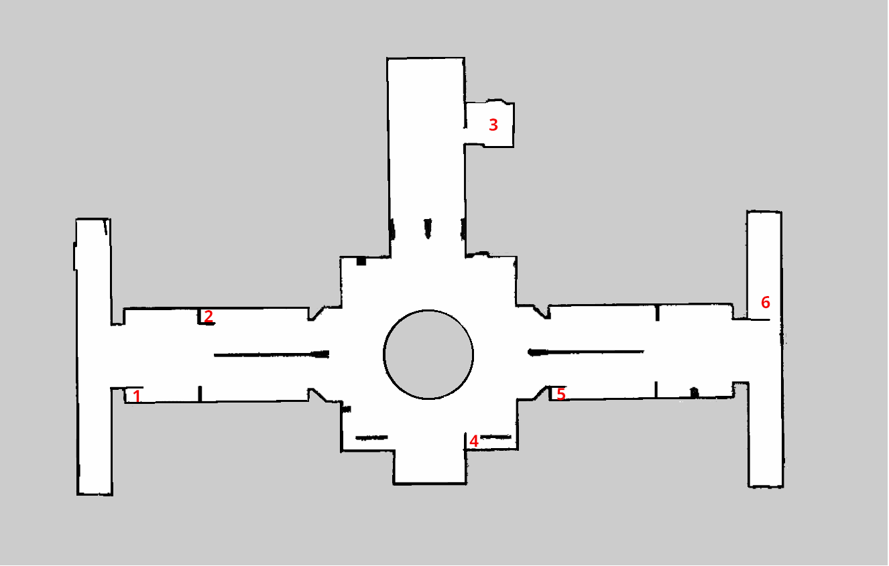
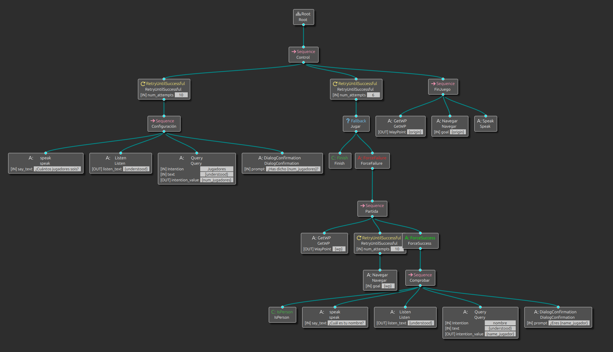
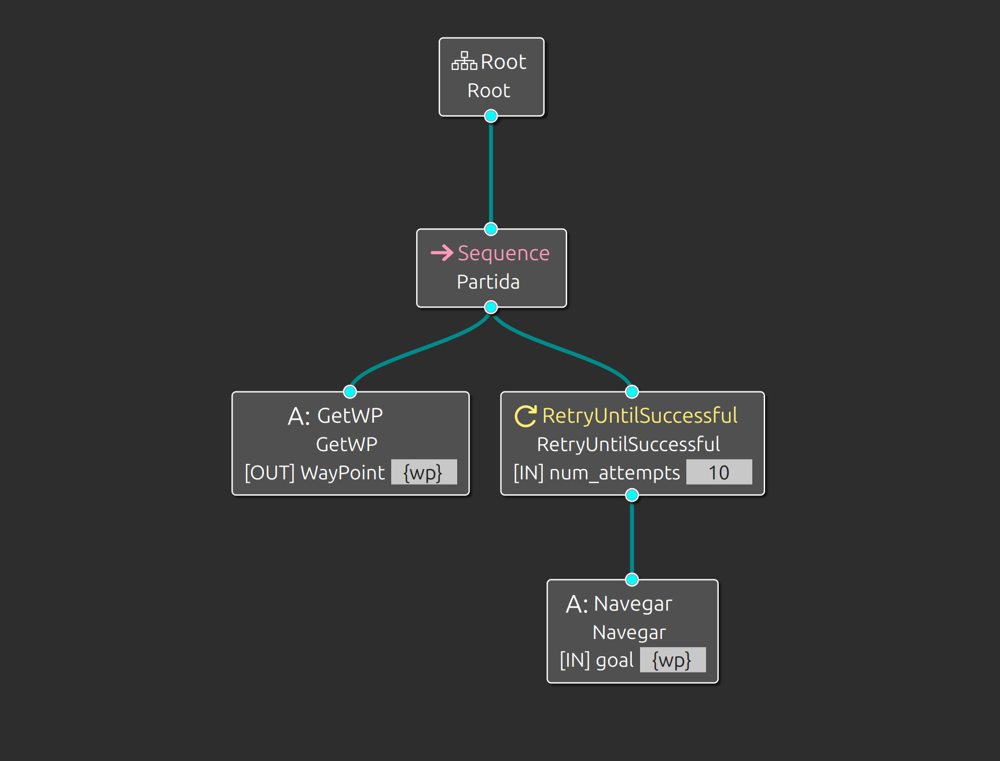
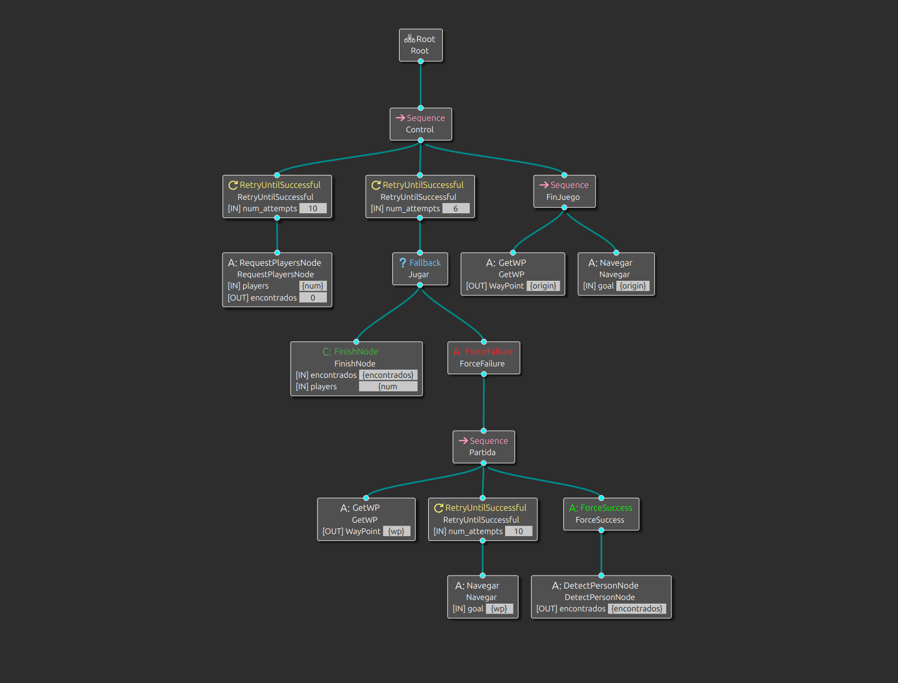

# Proyecto final arquitectura software para robots: Escondite
### Carla García Alejandre, Elías Muñoz Taín, Miguel Ángel Piña Martínez y María Yagüe LLamas

## 1. Introducción
Este proyecto plantea el desarrollo de un juego interactivo de escondite utilizando un **Kobuki**. La propuesta consiste en mapear un aula como espacio de juego y delimitar seis escondites fijos empleando los corchos disponibles en el laboratorio. Durante cada partida, varios jugadores se ocultarán en esos puntos predefinidos mientras el Kobuki los busca.  

El robot dispondrá de un número de intentos igual al número de jugadores más uno para localizar a todos los participantes. Para ello, se integrará el modelo de visión por computador `YOLO`, que permitirá al Kobuki detectar la presencia de personas en cada escondite y llevar un registro del número de jugadores encontrados.  

Además, se prevé incorporar un sistema de diálogo para dotar al Kobuki de una interacción verbal básica: contará en voz alta al inicio del juego, reaccionará cuando detecte a un jugador y anunciará el resultado final. Si el robot logra encontrar a todos los jugadores antes de agotar sus intentos, ganará la partida; en caso contrario, la victoria será para los jugadores.  

## 2. Espacio de juego
Hemos realizado el mapeo del pasillo de los laboratorios de la universidad para delimitar seis escondites. Utilizamos un robot `Kobuki` ejecutando ROS 2, que recorrió el pasillo recogiendo datos con sus sensores.

### Creación del mapa
Para generar el mapa, utilizamos el sistema de navegación `nav2`. En terminales diferentes, se lanzan los isguientes comandos.

**Lanzar Kobuki**

Primero lanzaremos el robot en un punto concreto, para determinar nuestro origen de coordenadas.

```bash
ros2 launch kobuki kobuki.launch.py astra:=true lidar_a2:=true
```

En nuestro caso fue la puerta del laboratorio.

**RViz 2**

Lanzamos en otra terminal `rviz2` y añadimos el topic `Map` para poder ir visualizando el mapa que va generando.

**Nodo SLAM**

El mapeo se hizo usando un nodo de SLAM (como slam_toolbox) para generar un mapa 2D del entorno. 

```bash
ros2 launch slam_toolbox online_async_launch.py params_file:=src/kobuki/config/kobuki_nav.yaml
```

**Mapa**

Lanzamos un nodo que se suscribirá a `/map` el cual uardará en disco cuando se solicite el mapa que se está generando.

```bash
ros2 launch nav2_map_server map_saver_server.launch.py
```

Controlamos al robot mediante teleoperación mientras visualizamos el proceso en RViz2. De manera opcional podemos añadir un teclado o un mando para trabajar más cómodos.

```bash
ros2 run teleop_twist_keyboard teleop_twist_keyboard
```

Una vez obtenido el mapa, lo guardaremos:

```bash
ros2 run nav2_mao_server map_saver_cli
```

Este último comando nos generará un archivo `.yaml` que será el que lanzaremos más adelante para utilizar el mapa y otro archivo `.pgm` que podremos editar con herramientas como `gimp` para limpiar el ruido generado.



## 3. Behaviour Tree
Un Behaviour Tree (árbol de comportamiento) es una estructura de control que organiza decisiones y acciones en forma jerárquica, permitiendo que un robot ejecute comportamientos complejos de manera modular y flexible. Cada nodo representa una acción o una condición, y el árbol se recorre para decidir qué hacer en cada momento.

En nuestro proyecto del juego del escondite, utilizaremos un Behaviour Tree para controlar la lógica del robot: por ejemplo, decidir si buscar un escondite, detectar si hay una persona escondida (o hablar con los jugadores). Esto nos permite separar claramente cada comportamiento y reaccionar según la situación.

Para diseñar este árbol de forma visual e intuitiva, hemos usado `Groot`, una herramienta que facilita la creación y edición de BTs compatibles con ROS2.

```bash
ros2 run groot Groot
```

Este es nuestro BT final, el cual representa la lógica completa del juego del escondite.



Sin embargo, durante el desarrollo fue necesario dividir el árbol en varios subárboles más pequeños para poder probar cada comportamiento por separado y asegurarnos de que todo funcionaba correctamente paso a paso.

Por ejemplo un BT para probar la navegación del robot hacia waypoints.



O una prueba del escondite funcional sin diálogo.



Esta estrategia nos permitió detectar errores fácilmente y validar el funcionamiento de cada parte antes de integrarlas en el árbol completo.

Groot nos permite diseñar visualmente el árbol de comportamiento y luego exportarlo como un archivo XML, que puede ser interpretado por el código en ROS 2. De esta forma, el árbol creado gráficamente se convierte en una estructura ejecutable por el robot.

## 4. Navegación y WayPoints

Navegar con waypoints consiste en mover un robot a través de una serie de puntos de referencia predefinidos (coordenadas) en un mapa. Cada waypoint representa una posición a la que el robot debe llegar siguiendo una ruta planificada.

En el contexto de los behavior trees, una blackboard es una memoria compartida donde los nodos del árbol pueden leer y escribir información. Funciona como una base de datos temporal que permite que diferentes partes del árbol se comuniquen entre sí sin necesidad de estar conectadas directamente.

Por ejemplo, si un nodo detecta un escondite, puede guardar sus coordenadas en la blackboard, y otro nodo, encargado de moverse, puede leer esa información para navegar hasta allí.

Dentro del código `bt_nav_main.cpp`:

Primero generamos los seis waypoints (escondites).


```cpp
std::vector<std::pair<double,double>> coords = {
    {0.53,  14.73},
    {5.53,  18.79},
    {17.02, 28.56},
    {17.27, 14.28},
    {23.74, 14.96},
    {32.50, 19.02}
  };
```
Gestionamos el número de jugadores que pueden jugar (mínimo 1 y máximo 5 porque hay 6 escondites).

```cpp
if (n_jugadores < 1 || n_jugadores > 5) {
    RCLCPP_ERROR(node->get_logger(), "Número de jugadores fuera de rango [1-5]");
    return 1;
  }
```
Una vez tenemos los 6 waypoints, se mezclan aleatoriamente usando C++ para seleccionar los escondites. Para ello, se utiliza una fuente de aleatoriedad `(std::random_device)` y un generador de números aleatorios `(std::mt19937)` inicializado con dicha fuente. A continuación, se aplica `std::shuffle` al vector `coords`, que contiene las coordenadas de los posibles escondites, para desordenarlas de forma aleatoria. Finalmente, se seleccionan tantas posiciones como jugadores haya, más una adicional, asegurándose de no exceder el número total de coordenadas disponibles. Estas ubicaciones serán los escondites que el Kobuki recorrerá para buscar a los jugadores escondidos.

```cpp
  std::random_device rd;
  std::mt19937 gen(rd());
  std::shuffle(coords.begin(), coords.end(), gen);
  int sitios = std::min(static_cast<int>(coords.size()), n_jugadores + 1);
```
Este fragmento de código recorre una lista de waypoints y hace que el robot los visite uno por uno. Para cada waypoint:
1. Lo publica en el blackboard (una memoria compartida usada por el árbol de comportamiento) y muestra por consola su posición.
```cpp
  for (size_t i = 0; i < waypoints.size() && rclcpp::ok(); ++i) {
    blackboard->set("waypoint", waypoints[i]);
    RCLCPP_INFO(node->get_logger(), "[Main] Enviando waypoint %zu: x=%.2f, y=%.2f", 
                i+1, 
                waypoints[i].pose.position.x, 
                waypoints[i].pose.position.y);
```

2. Ejecuta el árbol de comportamiento en bucle hasta que se complete la tarea asociada a ese waypoint.
```cpp
    bool finish = false;
    while (rclcpp::ok() && !finish) {
      rclcpp::spin_some(node);
      finish = tree.rootNode()->executeTick() != BT::NodeStatus::RUNNING;
      rate.sleep();
    }
```
3. Una vez alcanzado, espera 2 segundos antes de pasar al siguiente.
```cpp
    RCLCPP_INFO(node->get_logger(), "[Main] Esperando 2 segundos en el sitio...");
    rclcpp::sleep_for(std::chrono::seconds(2));
  }
```
Este ciclo continúa hasta que el robot haya recorrido todos los waypoints o hasta que el nodo de ROS se detenga. Una vez completado el recorrido, la navegación finaliza en la puerta del laboratorio, que corresponde al punto de inicio del juego y, por tanto, al origen del robot.

## 5. Yolo

aqui lo que explique miguel mañana

## 6. Sistema de diálogo

aqui lo de hablar si podemo shacerlo al final

## 7. Demostración

aqui video cuando lo terminemos