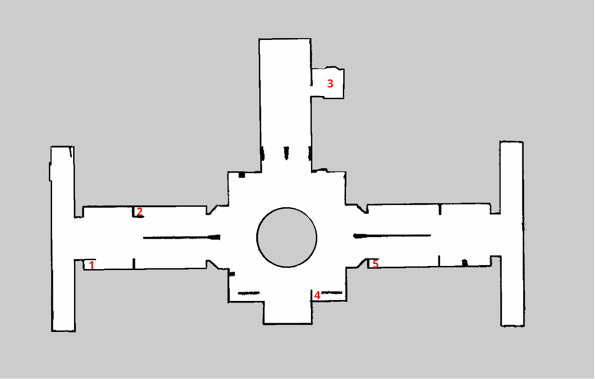

# Proyecto final arquitectura software para robots: Escondite
### Carla García Alejandre, Elías Muñoz Taín, Miguel Ángel Piña Martínez y María Yagüe LLamas

## 1. Introducción
Este proyecto plantea el desarrollo de un juego interactivo de escondite utilizando un **Kobuki**. La propuesta consiste en mapear un aula como espacio de juego y delimitar cinco escondites fijos empleando los corchos disponibles en el laboratorio. Durante cada partida, varios jugadores se ocultarán en esos puntos predefinidos mientras el Kobuki los busca.  

El robot dispondrá de un número de intentos igual al número de jugadores más uno para localizar a todos los participantes. Para ello, se integrará el modelo de visión por computador `YOLO`, que permitirá al Kobuki detectar la presencia de personas en cada escondite y llevar un registro del número de jugadores encontrados.  

Además, se prevé incorporar un sistema de diálogo para dotar al Kobuki de una interacción verbal básica: contará en voz alta al inicio del juego, reaccionará cuando detecte a un jugador y anunciará el resultado final. Si el robot logra encontrar a todos los jugadores antes de agotar sus intentos, ganará la partida. En caso contrario, la victoria será para los jugadores.  

## 2. Espacio de juego
Hemos realizado el mapeo del pasillo de los laboratorios de la universidad para delimitar cinco escondites. Utilizamos un robot `Kobuki` ejecutando ROS 2, que recorrió el pasillo recogiendo datos con sus sensores.

### Creación del mapa
Para generar el mapa, utilizamos el sistema de navegación `nav2`. En terminales diferentes, se lanzan los isguientes comandos.

**Lanzar Kobuki**

Primero lanzaremos el robot en un punto concreto, para determinar nuestro origen de coordenadas.

```bash
ros2 launch kobuki kobuki.launch.py astra:=true lidar_a2:=true
```

En nuestro caso fue la puerta del laboratorio.

**RViz 2**

Lanzamos en otra terminal `rviz2` y añadimos el topic `Map` para poder ir visualizando el mapa que va generando.

**Nodo SLAM**

El mapeo se hizo usando un nodo de SLAM (como slam_toolbox) para generar un mapa 2D del entorno. 

```bash
ros2 launch slam_toolbox online_async_launch.py params_file:=src/kobuki/config/kobuki_nav.yaml
```

**Mapa**

Lanzamos un nodo que se suscribirá a `/map` el cual guarda en disco cuando se solicite el mapa que se está generando.

```bash
ros2 launch nav2_map_server map_saver_server.launch.py
```

Controlamos al robot mediante teleoperación mientras visualizamos el proceso en RViz2. De manera opcional podemos añadir un teclado o un mando para trabajar más cómodos.

```bash
ros2 run teleop_twist_keyboard teleop_twist_keyboard
```

Una vez obtenido el mapa, lo guardamos:

```bash
ros2 run nav2_mao_server map_saver_cli
```

Este último comando nos genera un archivo `.yaml` que será el que lanzaremos más adelante para utilizar el mapa y otro archivo `.pgm` que podremos editar con herramientas como `gimp` para limpiar el ruido generado.



## 3. Behaviour Tree
Un Behaviour Tree (árbol de comportamiento) es una estructura de control que organiza decisiones y acciones en forma jerárquica, permitiendo que un robot ejecute comportamientos complejos de manera modular y flexible. Cada nodo representa una acción o una condición, y el árbol se recorre para decidir qué hacer en cada momento.

En nuestro proyecto del juego del escondite, utilizaremos un Behaviour Tree para controlar la lógica del robot: por ejemplo, decidir si buscar un escondite, detectar si hay una persona escondida (o hablar con los jugadores). Esto nos permite separar claramente cada comportamiento y reaccionar según la situación.

Para diseñar este árbol de forma visual e intuitiva, hemos usado `Groot`, una herramienta que facilita la creación y edición de BTs compatibles con ROS2.

```bash
ros2 run groot Groot
```

Este es nuestro BT final, el cual representa la lógica completa del juego del escondite.


Sin embargo, durante el desarrollo fue necesario dividir el árbol en varios subárboles más pequeños para poder probar cada comportamiento por separado y asegurarnos de que todo funcionaba correctamente paso a paso.

Por ejemplo un BT para probar la navegación del robot hacia waypoints.


O una prueba del escondite funcional sin diálogo.


Esta estrategia nos permitió detectar errores fácilmente y validar el funcionamiento de cada parte antes de integrarlas en el árbol completo.

Groot nos permite diseñar visualmente el árbol de comportamiento y luego exportarlo como un archivo XML, que puede ser interpretado por el código en ROS 2. De esta forma, el árbol creado gráficamente se convierte en una estructura ejecutable por el robot.

## 4. Navegación y WayPoints

La navegación consiste en guiar a un robot a través de su entorno para alcanzar uno o varios objetivos, evitando obstáculos y manteniendo una trayectoria segura. Uno de los enfoques comunes para lograr esto es mediante el uso de WayPoints, que son puntos de referencia espaciales (con posición y orientación) que el robot debe visitar.

En el contexto de un sistema de comportamiento basado en Behavior Trees y ROS 2, se implementan distintos nodos que cooperan para planificar y ejecutar la navegación. A continuación explicaremos tres nodos clave: `RandomWP`, `GetWaypoint` y `Move`.

### RandomWP: generación de waypoints aleatorios

El nodo `RandomWP` se encarga de generar una lista de waypoints aleatorios, que serán utilizados por el robot para navegar hacia ubicaciones de interés. Estos puntos están predefinidos como coordenadas reales dentro del entorno y se eligen de forma aleatoria para simular exploración o búsqueda.
```cpp
 coords_ = {
    {0.53, 14.73},
    {5.53, 18.79},
    {17.02, 28.56},
    {17.06, 14.07},
    {23.74, 14.96},
    {32.50, 19.02},
  };
```

Estas coordenadas son en orden, los lugares señalados en rojo en el apartado de [Creación del mapa](#creacion-del-mapa).

Durante el primer tick, se genera un conjunto aleatorio de posiciones y orientaciones con:
```cpp
random_number = random_unique_array(jugadores_ + 1);
```
Por cada jugador (más uno), se crea una estructura `PoseStamped` que contiene tanto la posición como la orientación del robot:
```cpp
ps.pose.position.x = coords_[idx].first;
ps.pose.orientation.z = orientation_[idx].first;
```

Las orientaciones del Kobuki en cada uno de los escondites se ha calculado usando cuaterniones con la siguiente fórmula donde cada una de las coordenadas corresponde a x, y, z, w.


```cpp
orientation_ = {
    {1, 0},
    {1, 0},
    {0, 1},
    {-0.73624, 0.67672},
    {-1, 0.0},
    {-0.7236, 0.6902}
  };
```
Todos estos puntos se almacenan en un `nav_msgs::msg::Path` y se guardan en la blackboard bajo la clave "Wps" para su uso posterior:
```cpp
config().blackboard->set<nav_msgs::msg::Path>("Wps", wps_array_);
```
### Nodo GetWaypoint: selección secuencial de waypoints

El nodo GetWaypoint se encarga de extraer uno por uno los WayPoints generados previamente por `RandomWP`. Cada vez que se ejecuta un tick, este nodo obtiene el índice actual `i` desde la *blackboard* y extrae el WayPoint correspondiente:
```cpp
wp_ = wps_array_.poses[i];  
i++;
```
Después, guarda ese WayPoint específico bajo la clave "wp", para que el nodo de movimiento lo utilice:
```cpp
config().blackboard->set<geometry_msgs::msg::PoseStamped>("wp", wp_);
```
Esto permite al árbol de comportamiento enviar al robot hacia el siguiente destino en una secuencia ordenada.

### Nodo Move: ejecución de navegación

El nodo Move es el encargado de realizar la navegación real hacia un waypoint utilizando la acción `navigate_to_pose` del stack de navegación de ROS 2 (nav2). Es un nodo de acción que, al hacer tick, lee el destino desde la blackboard:
```cpp
config().blackboard->get("wp", goal);
```
Ajusta el `timestamp` y el marco de referencia:
```cpp
goal.header.frame_id = "map";  
goal.header.stamp = node_->get_clock()->now();
```
Y lanza la acción para que el robot comience a moverse hacia el punto indicado. Si la navegación tiene éxito, registra un mensaje:
```cpp
RCLCPP_INFO(node_->get_logger(), "** NAVIGATION SUCCEEDED **");
```

## 5. Yolo
YOLO en ROS 2 es la integración de un modelo de detección de objetos en tiempo real dentro del sistema robótico ROS 2. YOLO utiliza redes neuronales para identificar y localizar múltiples objetos en una imagen con gran velocidad y precisión. En el contexto de ROS 2, se implementa como un nodo que recibe imágenes de una cámara (por ejemplo, desde el topic `/color/image_raw)`, procesa cada fotograma mediante el modelo YOLO y publica los resultados (como las clases detectadas, coordenadas de los objetos y niveles de confianza) en topics como `/yolo/detections`. Esta información es utilizada por otros nodos del robot para tareas como navegación, manipulación o interacción con el entorno.

### Camera

Dentro del paquete camera se encuentra este código que implementa un nodo de ROS 2 llamado `YoloDetectionNode`, diseñado para convertir detecciones de objetos generadas por un modelo YOLO a un formato estándar utilizado en ROS 2. Este nodo permite la interoperabilidad entre mensajes personalizados y mensajes estándar para visión artificial.

El nodo se declara con `: Node("darkent_detection_node")`, lo que indica que su nombre interno será `darkent_detection_node`. Al inicializarse, se suscribe al topic `"input_detection"` usando el mensaje `yolo_msgs::msg::DetectionArray`, como se muestra en:

```cpp
  detection_sub_ = create_subscription<yolo_msgs::msg::DetectionArray>(
  "input_detection", rclcpp::SensorDataQoS().reliable(),
  std::bind(&YoloDetectionNode::detection_callback, this, _1));
```

Esto significa que el nodo recibirá las detecciones del modelo YOLO, que vienen en un formato personalizado con información como clase, puntuación y caja delimitadora.

Cuando se recibe un mensaje, se ejecuta el método detection_callback, donde se crea un nuevo mensaje del tipo vision_msgs::msg::Detection2DArray, un formato estándar en ROS 2:

```cpp
vision_msgs::msg::Detection2DArray detection_array_msg;
```

Cada detección se traduce del mensaje personalizado al formato estándar copiando la información relevante y finalmente, todas las detecciones convertidas se publican en el topic "output_detection_2d":

```cpp
detection_msg.bbox.center.position.x = detection.bbox.center.position.x;
detection_msg.bbox.size_x = detection.bbox.size.x;
obj_msg.hypothesis.class_id = detection.class_name;
obj_msg.hypothesis.score = detection.score;

detection_pub_->publish(detection_array_msg);
```

### Detect Person Node

El nodo `DetectPersonNode`, parte del sistema de comportamiento implementado con Behavior Trees y ROS 2, se encarga de detectar personas a través de mensajes provenientes de un detector basado en YOLO. El objetivo principal es procesar las detecciones visuales en cada ciclo de ejecución (tick), identificar si hay personas presentes en la escena y actualizar dicha información en la blackboard compartida del árbol de comportamiento.

La clase se define como un nodo de acción sincrónica:

```cpp
DetectPersonNode::DetectPersonNode(
  const std::string & name,
  const BT::NodeConfiguration & config)
: BT::SyncActionNode(name, config),
  person_detected_(false)
```

Aquí se inicializa el nodo como una acción sincrónica (SyncActionNode) y se establece un indicador (person_detected_) que se actualizará más adelante si se detecta una persona.

Uno de los aspectos más importantes es la suscripción al topic `/detection_2d`, que entrega mensajes del tipo `vision_msgs::msg::Detection2DArray`. Esta suscripción permite recibir los resultados del modelo `YOLO` que se ejecuta en otro nodo:
```cpp
sub_ = node_->create_subscription<vision_msgs::msg::Detection2DArray>(
  "/detection_2d", 10,
  std::bind(&DetectPersonNode::detection_callback, this, _1));
```
Cuando se reciben nuevos datos, se llama a `detection_callback`, donde se analiza cada detección para verificar si el objeto detectado tiene una `class_id` igual a *person*:
```cpp
void DetectPersonNode::detection_callback(
  const vision_msgs::msg::Detection2DArray::SharedPtr msg)
{
  encontrado_yolo = 0;
  for (const auto & detection : msg->detections) {
    if (!detection.results.empty() &&
        detection.results[0].hypothesis.class_id == "person")
    {
      encontrado_yolo ++;
      person_detected_ = true;
    } else {
      person_detected_ = false;
    }
  }
}
```
Esta función transforma la información visual en una representación interna (aquí simplemente un contador), sumando cuántas personas se detectaron. La variable `encontrado_yolo` guarda ese número temporalmente. Si se detecta al menos una persona, se activa el flag `person_detected_`.

Durante cada tick del árbol de comportamiento, se ejecutan los callbacks pendientes mediante:
```cpp
executor_.spin_some();  // ejecuta los callbacks pendientes
```
Luego, si no se ha detectado ninguna persona, se informa el fallo:
```cpp
if (!person_detected_) {
  RCLCPP_INFO(node_->get_logger(), "[BT] No se detectó persona");
  return BT::NodeStatus::FAILURE;
}
```
Si se detectaron personas, el nodo lee la variable acumulada encontrados desde la blackboard, suma los nuevos hallazgos y vuelve a escribir el resultado en la misma:
```cpp
config().blackboard->get("encontrados", find_players);

find_players = find_players + encontrado_yolo;
setOutput("encontrados", find_players);
```
Finalmente, el nodo retorna `SUCCESS`, indicando que el procesamiento fue exitoso, y registra por consola cuántas personas detectó en este tick:
```cpp
RCLCPP_INFO(node_->get_logger(), "[BT] Persona detectada: %d", encontrado_yolo);
return BT::NodeStatus::SUCCESS;
```


## 6. Sistema de diálogo

Para permitir que el robot Kobuki sea capaz de hablar e interactuar mediante voz, hemos incorporado capacidades de Interacción Humano-Robot (HRI), centradas en el uso de comandos de voz y respuestas habladas. Estas capacidades permiten que el robot entienda ciertas órdenes vocales y responda mediante síntesis de voz, facilitando una comunicación más natural con el usuario.

En nuestro caso hemos utilizado un enfoque directo basado en HRI para dotar al robot de esta funcionalidad básica, existen soluciones más avanzadas y completas para el procesamiento del lenguaje natural, como `Dialogflow` de Google.

Para dotar al robot Kobuki de la capacidad de hablar e interactuar verbalmente con el usuario, implementamos e integramos el nodo `Speak`, parte del paquete `hri_bt_nodes`, dentro de nuestro árbol de comportamiento (BT). Este nodo permite generar respuestas por voz utilizando el sistema de texto a voz (TTS) definido en `audio_common_msgs::action::TTS`.

El nodo Speak extiende la clase `BtActionNode`, especializada en lanzar acciones ROS 2 dentro de un BT. En su constructor se inicializan dos publishers:
```cpp
speech_text_publisher_ = node_->create_publisher<std_msgs::msg::String>("speech_text", 10);
speech_start_publisher_ = node_->create_publisher<std_msgs::msg::Int8>("dialog_phase", 10);
```
Estos publishers permiten que el sistema publique el texto que debe pronunciarse, así como una señal para indicar el inicio de la fase de diálogo. La publicación se activa durante el `on_tick`, donde también se procesan los parámetros del texto a pronunciar:
```cpp
getInput("speech_text", text);
getInput("params", sparams);
text = swap_placeholders(text, params);
```
El método `swap_placeholders` reemplaza marcadores en el texto ([] por defecto) con parámetros dinámicos, permitiendo que las frases pronunciadas se adapten al contexto.

Finalmente, el nodo envía el objetivo (goal) con el texto final:
```cpp
goal_.text = text;
```
Y publica el mensaje correspondiente para activar la reproducción de voz:
```cpp
speech_text_publisher_->publish(speech_text_msg_);
speech_start_publisher_->publish(speech_start_msg_);
```
### Integración en el sistema BT

Este nodo fue registrado y cargado dinámicamente a través del archivo `main_hri.cpp`, donde se declara el nodo `hri_node` y se configuran sus transiciones de ciclo de vida (configure y activate). El archivo XML con el árbol de comportamiento se carga desde el parámetro `bt_xml_file`, y los plugins BT (como Speak) se registran dinámicamente:
```cpp
factory.registerFromPlugin(loader.getOSName(plugin));
```
Esto permite que `Speak` esté disponible como un nodo de acción reutilizable dentro del árbol, y que pueda ser invocado cuando se requiera una interacción verbal por parte del robot.

### Observación

Dentro del paquete de interacción vocal, existen cuatro nodos principales diseñados para la comunicación entre el usuario y el robot: `Speak`, `Listen`, `Query` y `DialogConfirm`. De estos, hemos utilizado únicamente el nodo `Speak`, que permite que el robot hable y emita mensajes de voz hacia el usuario.

Sin embargo, no se integraron los nodos `Listen`, `Query` ni `DialogConfirm` en el árbol de comportamiento final. La razón principal es que el nodo `Listen`, encargado de captar las respuestas del usuario, no se implementó, lo que imposibilitó el uso efectivo de `Query`, que depende de esa entrada para almacenar valores en la *blackboard*, ni de `DialogConfirm`, que requiere la verificación de respuestas verbales del usuario. Dado que la funcionalidad de recepción de voz no estaba operativa, decidimos centrarnos únicamente en la salida de voz del robot, usando `Speak` como única forma de interacción verbal en este proyecto.

## 7. Demostración

A continuación se presenta un vídeo con la demostración del proyecto *El Escondite*, simulando una partida real. En esta grabación se pueden observar tanto el funcionamiento del sistema como la dinámica del juego en un entorno controlado.
